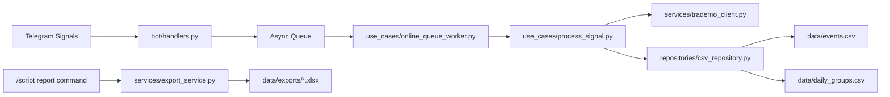

# TradeMo Signal Control Panel

Production-oriented backend service that turns Telegram device alerts into verified, auditable events and ready-to-send reports.

I built a queue-driven pipeline that ingests Telegram messages, enriches them with site data using Playwright, deduplicates events, persists canonical records (CSV), and generates XLSX exports on demand. Configuration is environment-driven to support safe deployment.

## Problem statement

Operations teams were manually processing high-volume Telegram alerts to verify device payment status. The workflow involved opening device pages for each alert, copying data into spreadsheets, and manually deduplicating entries — a slow, error-prone process that produced inconsistent daily reports.

## Solution

Automated pipeline that reliably converts notifications into canonical events and exports:

- Ingest: Telethon handlers detect configured trigger text and enqueue jobs.
- Enrich: Playwright fetches the latest device message for accurate state.
- Persist: deterministic deduplication and CSV-first storage for auditability.
- Report: single-command XLSX generation and delivery via the bot for operations.

## Key features

- Async, queue-based ingestion and worker processing (asyncio) for backpressure control.
- Site enrichment via Playwright (persistent profile + headless modes).
- Deterministic deduplication using last-seen fingerprints.
- CSV-first persistence as canonical audit logs; XLSX export for stakeholders.
- Operator tooling: `authenticator.py` (profile setup), `/script` report command.

## Architecture overview

Telegram handlers enqueue processing jobs to an async queue. Workers dequeue jobs, call the Playwright client for site enrichment, apply deduplication logic, and persist canonical rows to CSV. An export service reads CSVs and produces XLSX reports on demand.

## Tech stack

- Python 3.10+ (asyncio)
- Telethon (Telegram)
- Playwright (Chromium persistent context)
- openpyxl (XLSX export)
- Python standard library CSV module for canonical storage

## Key engineering decisions

- CSV-first canonical store: simple, human-readable audit trail that is portable and easy to inspect.
- Async queue + worker model: separates fast ingestion from potentially slow enrichment and controls concurrency.
- Playwright persistent profile: balances authenticated scraping reliability with headless automation.
- Environment-driven secrets: `.env` + `.gitignore` to avoid leaking credentials and to ease environment promotion.

## Challenges & mitigations

- Playwright variability: explicit timeouts, retries with backoff, and both persistent and ephemeral contexts to reduce flakiness.
- Duplicate alerts: deterministic fingerprinting and last-seen memory ensure idempotent writes.
- Authenticated scraping in CI/servers: `authenticator.py` to bootstrap a persistent profile and support headless mode for ephemeral runs.

## Ownership

- Designed and implemented the end-to-end pipeline: ingestion (`bot/handlers.py`), worker orchestration (`use_cases/online_queue_worker.py`), enrichment (`services/trademo_client.py`), persistence (`repositories/csv_repository.py`), export (`services/export_service.py`).
- Implemented reliability and ops features: deterministic deduplication, environment-driven configuration, and operator utilities (`authenticator.py`).
- Assembled a production-style repository with `README.md`, `.env.example`, and tooling to bootstrap authenticated Playwright profiles.

## Business impact

- Removes manual verification and spreadsheet maintenance from a daily operational task.
- Provides an auditable CSV trail that improves confidence in daily reports.
- Enables faster, consistent reporting to stakeholders with a single operator command.
